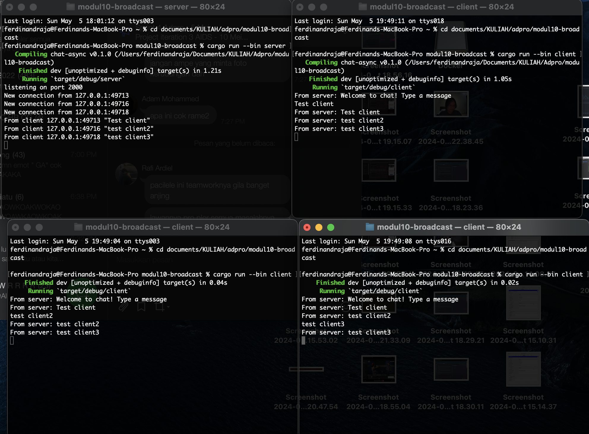

## Ferdinand Raja Kenedy 2206046683

### Experiment 2.1: Original code, and how it run

When I run the 3 client and 1 server, I saw that everytime I send a message from a client, the server will send that message to all the clients that are active or run.

### Experiment 2.2: Modifying port
For  `server.rs`, there needs to be a change in the main function. The same also applied for `client.rs`, where the changes that are being made is in main fucntion. both port needs to be the same for both client and server to be connected. I also realize that both `server.rs` and `client.rs` use a diferent protocol, where server use TCP and client use websocket.